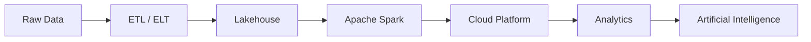
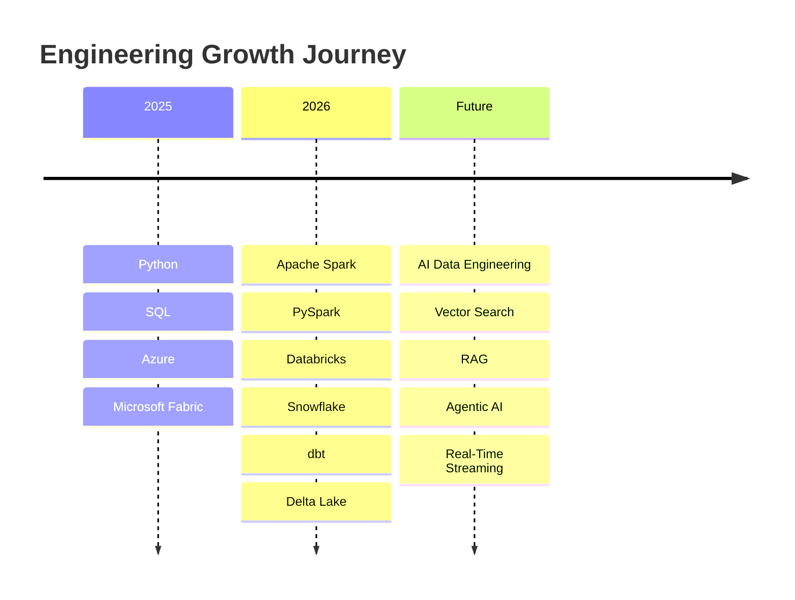

<!-- ======================================================= -->
<!--                    ABOUT ME                             -->
<!-- ======================================================= -->

<h2 align="center">
 
 Engineering Identity
</h2>

<div align="center">

> **Building enterprise-scale data platforms that power analytics, AI, and intelligent decision-making.**

</div>

<br>

<table>

<tr>

<td width="62%" valign="top">

## About Me

I'm **Aniket Trivedi**, an aspiring **AI-Powered Data Engineer** passionate about designing modern data ecosystems that transform raw information into reliable, scalable, and analytics-ready assets.

My engineering interests revolve around **distributed data processing**, **Lakehouse architectures**, **cloud-native ETL pipelines**, **big data systems**, and the intersection of **Artificial Intelligence with Data Engineering**.

I enjoy architecting end-to-end data platforms using **Microsoft Fabric**, **Azure**, **AWS**, **Apache Spark**, **PySpark**, and modern cloud technologies while continuously expanding into **Databricks**, **Snowflake**, **dbt**, **Streaming Systems**, and **LLM-powered Data Applications**.

Rather than simply writing code, I enjoy designing systems that are scalable, maintainable, observable, and production-ready.

</td>

<td width="38%" valign="top">

### Profile Snapshot

```yaml
Role:
  AI Powered Data Engineer

Location:
  Gurgaon, India 🇮🇳

Education:
  B.Tech Computer Science (AI)

Experience:
  Data Engineering
  Data Analytics

Primary Focus:
  Modern Data Platforms

Target:
  Product-Based Companies

Open To:
  Full-Time
  Internships
  Open Source
```

</td>

</tr>

</table>

---

# Enterprise Capability Matrix

<div align="center">

| Engineering Domain | Technologies | Confidence |
|:-------------------|:-------------|:----------:|
| **Programming** | Python • SQL • PySpark • Spark SQL | ████████░░ |
| **Data Engineering** | ETL • ELT • Data Modeling • Lakehouse • Warehousing | ████████░░ |
| **Big Data** | Apache Spark • Delta Lake • Distributed Processing | ███████░░░ |
| **Cloud Engineering** | Azure • Microsoft Fabric • AWS | ████████░░ |
| **Analytics** | Power BI • Pandas • NumPy • SQL Analytics | ████████░░ |
| **Version Control** | Git • GitHub • CI/CD Fundamentals | ███████░░░ |
| **Modern Data Stack** | Databricks • Snowflake • dbt | ██████░░░░ |
| **AI Engineering** | RAG • Vector DB • LLM Applications | █████░░░░░ |

</div>

---

# Engineering Architecture

<div align="center">



</div>

---

# Technology Ecosystem

<table>

<tr>

<td width="50%">

## Core Stack

- Python
- SQL
- Apache Spark
- PySpark
- Microsoft Fabric
- Azure
- AWS
- Power BI

</td>

<td width="50%">

## Expanding Into

- Databricks
- Snowflake
- dbt
- Delta Lake
- Unity Catalog
- Lakeflow
- Spark Streaming
- AI Data Systems

</td>

</tr>

</table>

---

# Engineering Principles

<div align="center">

| Principle | Philosophy |
|-----------|------------|
| **Scalability** | Build systems that grow with data |
| **Reliability** | Pipelines should be dependable and repeatable |
| **Performance** | Optimize before scaling |
| **Automation** | Reduce manual work through orchestration |
| **Observability** | Every pipeline should be measurable |
| **Continuous Learning** | The data ecosystem evolves every day |

</div>

---

# 2026 Engineering Roadmap

<div align="center">



</div>

---

# Current Mission

<table>

<tr>

<td width="33%">

### Learning

- Databricks
- Snowflake
- dbt
- Spark Streaming
- Unity Catalog

</td>

<td width="33%">

### Building

- Enterprise Data Pipelines
- Medallion Architecture
- Fabric Projects
- Spark Projects
- Cloud Data Platforms

</td>

<td width="33%">

### Exploring

- Retrieval-Augmented Generation
- Vector Databases
- AI Agents
- MCP
- LLM Applications

</td>

</tr>

</table>

---

<div align="center">

### Open for Opportunities

**Data Engineering • Analytics Engineering • Cloud Data Engineering • AI Data Platforms • Open Source Collaboration**

</div>

---
